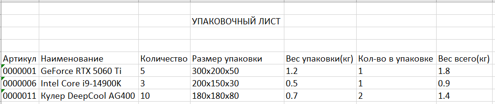
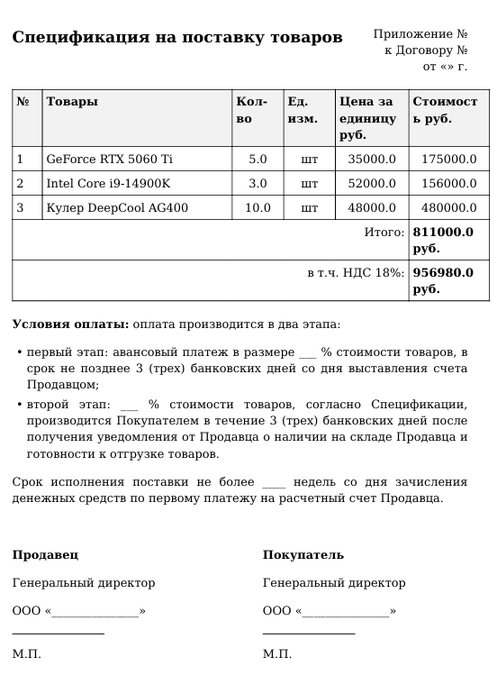

# 🤖 RPA-робот «Умник»  
**Автоматизация заполнения ценовой спецификации по данным из упаковочного листа**

Разработано в соответствии с [Техническим заданием](ТЗ по RPA Александров Андрей Алексеевич 11.11.2025 (1).docx).

---

## 📌 Описание

RPA-робот «Умник» автоматизирует рутинный процесс переноса данных из **упаковочного листа** (Excel) в **ценовую спецификацию** (PDF).  
Система:
- Принимает один или несколько `.xlsx`-файлов с номенклатурой и количеством,
- Запрашивает актуальные цены из имитации 1С (PostgreSQL),
- Генерирует единый PDF-документ по официальному шаблону.

⏱️ Время обработки: **менее 10 секунд** вместо 3 часов ручной работы.  
✅ Ошибки: **исключены**.

---

## 📂 Входные данные: упаковочный лист (Excel)

Формат: `.xlsx`  
Структура:  
- Старт данных — с 5-й строки,  
- Колонки: **Артикул**, **Наименование**, **Количество**, и др. (остальные игнорируются).

Пример файла:



> ℹ️ Файл: [`table-example.xlsx`](table-example.xlsx)

---

## 📄 Выходные данные: ценовая спецификация (PDF)

Сгенерированный документ полностью соответствует корпоративному шаблону:
- Заголовок: *«Спецификация на поставку товаров»*,
- Правый верхний угол: *«Приложение № … к Договору № … от ___ г.»* (поля оставлены пустыми для ручного заполнения),
- Таблица с нумерацией, итогами и НДС,
- Условия оплаты и поля для подписей.

Пример сгенерированного PDF:



> ℹ️ Результат сохраняется как `Ценовая_спецификация.pdf`.

---

## 🧰 Технологический стек

- **Backend**: FastAPI + Python 3.11
- **Frontend**: Streamlit
- **База данных**: PostgreSQL (имитация 1С)
- **Генерация PDF**: WeasyPrint + Jinja2 (HTML → PDF)
- **Контейнеризация**: Docker + Docker Compose

---

## 🚀 Запуск проекта

1. Убедитесь, что установлены:
   - [Docker](https://www.docker.com/)
   - [Docker Compose](https://docs.docker.com/compose/)

2. Склонируйте репозиторий и перейдите в папку проекта:
   ```bash
   git clone <ваш-репозиторий>
   cd RPA_ropot_parser